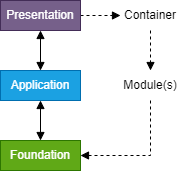

# Mason

Mason is a [plugin](https://eli.thegreenplace.net/2021/plugins-in-go/) framework for statically compiled Go.
Plugin systems are *messy*.
[Inversion of control](https://www.henrydu.com/2022/01/09/golang-inversion-of-control/) is *messy*.
This Go module was named after stone masons because it provides a simplistic API for constructing application pyramids.
There may be better examples in a future update, but for now check out the
[TestConfigure](https://github.com/pedregon/mason/blob/main/v1/module_test.go) for an
[`github.com/uber/fx`](https://uber-go.github.io/fx/) implementation.
## Design Pattern
The recommended design pattern for plugin registration is to mimic 
[`database/sql`](https://eli.thegreenplace.net/2019/design-patterns-in-gos-databasesql-package/) with anonymous
package imports as the plugin discovery mechanism. 
[Build tags](https://www.digitalocean.com/community/tutorials/customizing-go-binaries-with-build-tags) 
may also be used for compile-time inclusivity.
## Rational
Mason was developed to offer an alternative to the standard library [`plugin`](https://pkg.go.dev/plugin),
RPC solutions such as [`github.com/hashicorp/go-plugin`](https://github.com/hashicorp/go-plugin),
and other network-based solutions. Mason revolves around a 
[`Context`](https://github.com/pedregon/mason/blob/main/v1/context.go) in which 
[`ServiceFunc`](https://go.dev/tour/methods/14) function(s) are hooked by *loaded*
[`Module`](https://github.com/pedregon/mason/blob/main/v1/module.go) interface(s). Mason takes care
of the plugin dependency plumbing and empowers custom discovery, registration, and hooking. Upon application
construction, `Context` is
[*configured*](https://learn.microsoft.com/en-us/dotnet/core/extensions/dependency-injection) using a 
[`Builder`](https://github.com/pedregon/mason/blob/main/v1/mason.go) interface for *encouraged*
inversion of control abstraction. 
Initially, [`github.com/uber/fx`](https://uber-go.github.io/fx/) was first-class 
supported because it was arguably the best documented and easiest to use (no code generation or type inferring) 
dependency injection framework, but it has since been decided that a) users do not want to be forcibly dependent on 
an external library and b) some consider dependency injection systems to be an unnecessary anti-pattern. 
Therefore, to remain idiomatic, `ServiceFunc` was created to serve as a
[functional option](https://dave.cheney.net/2014/10/17/functional-options-for-friendly-apis) for `Builder` when
[`Configure`](https://github.com/pedregon/mason/blob/main/v1/mason.go) is called to construct a `Container`of 
loosely coupled application layer logic. `Container` is the end product for presentation layer use.
In the following diagram, arrow direction represents use. Masoncomponents are aligned with an example layered architecture.

Mason by no means claims to be a perfect solution, and it is open to feedback!
## Contributing
This project is open to [pull requests](https://github.com/pedregon/mason/pulls)!
For discussions, submit an [issue](https://github.com/pedregon/mason/issues). Please
[sign Git commits](https://docs.github.com/en/authentication/managing-commit-signature-verification/signing-commits) and
adhere to official [Go module versioning](https://go.dev/doc/modules/version-numbers) when
[publishing](https://go.dev/doc/modules/publishing). Notice the current
[retractions](https://go.dev/ref/mod#go-mod-file-retract) in the [go.mod](https://proxy.golang.org/).
